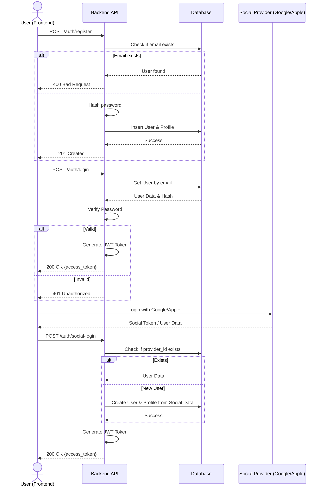

# Authentication Flow

```mermaid
sequenceDiagram
    actor User as User (Frontend)
    participant API as Backend API
    participant DB as Database
    participant External as Social Provider (Google/Apple)

    %% Registration
    User->>API: POST /auth/register
    API->>DB: Check if email exists
    alt Email exists
        DB-->>API: User found
        API-->>User: 400 Bad Request
    else
        API->>API: Hash password
        API->>DB: Insert User & Profile
        DB-->>API: Success
        API-->>User: 201 Created
    end

    %% Standard Login
    User->>API: POST /auth/login
    API->>DB: Get User by email
    DB-->>API: User Data & Hash
    API->>API: Verify Password
    alt Valid
        API->>API: Generate JWT Token
        API-->>User: 200 OK {access_token}
    else Invalid
        API-->>User: 401 Unauthorized
    end

    %% Social Login
    User->>External: Login with Google/Apple
    External-->>User: Social Token / User Data
    User->>API: POST /auth/social-login
    API->>DB: Check if provider_id exists
    alt Exists
        DB-->>API: User Data
    else New User
        API->>DB: Create User & Profile from Social Data
        DB-->>API: Success
    end
    API->>API: Generate JWT Token
    API-->>User: 200 OK {access_token}
```
