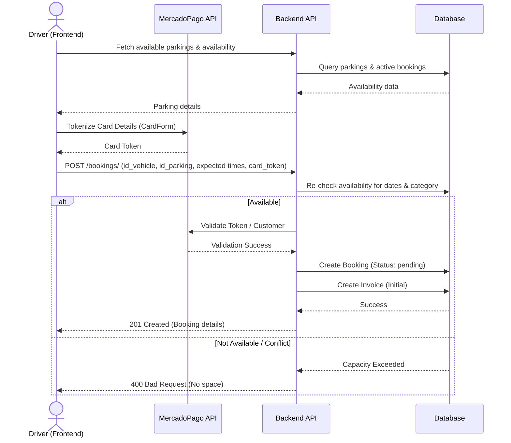

# Booking Creation Flow

```mermaid
sequenceDiagram
    actor Driver as Driver (Frontend)
    participant MP as MercadoPago API
    participant API as Backend API
    participant DB as Database

    Driver->>API: Fetch available parkings & availability
    API->>DB: Query parkings & active bookings
    DB-->>API: Availability data
    API-->>Driver: Parking details

    Driver->>MP: Tokenize Card Details (CardForm)
    MP-->>Driver: Card Token

    Driver->>API: POST /bookings/ (id_vehicle, id_parking, expected times, card_token)
    API->>DB: Re-check availability for dates & category
    alt Available
        API->>MP: Validate Token / Customer
        MP-->>API: Validation Success
        API->>DB: Create Booking (Status: pending)
        API->>DB: Create Invoice (Initial)
        DB-->>API: Success
        API-->>Driver: 201 Created (Booking details)
    else Not Available / Conflict
        DB-->>API: Capacity Exceeded
        API-->>Driver: 400 Bad Request (No space)
    end
```
