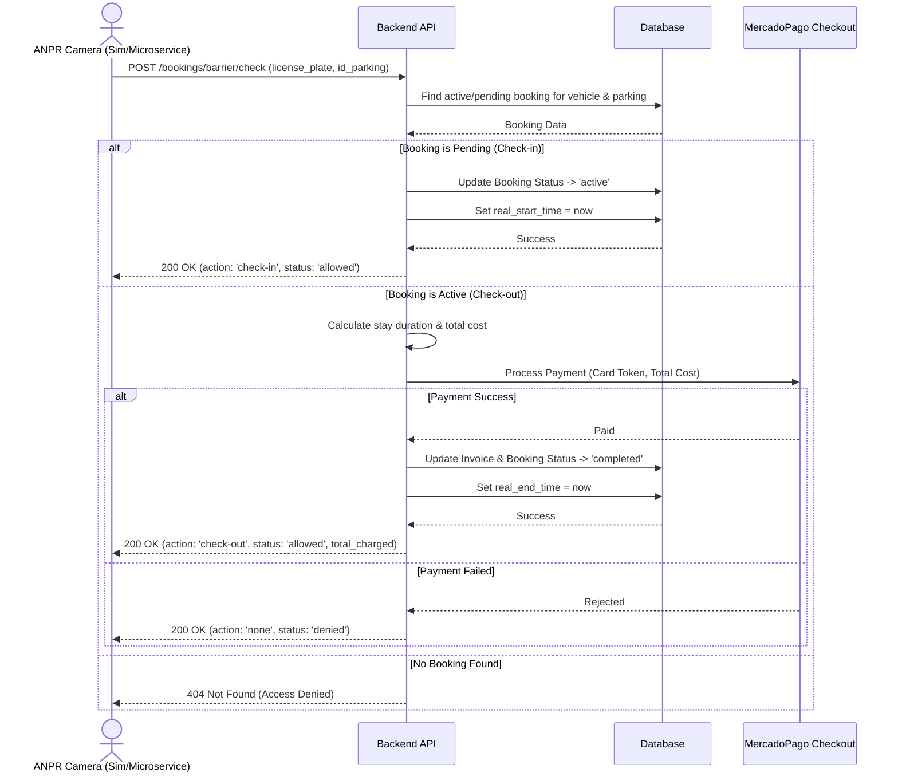

# Barrier Access Flow (ANPR & Check-in / Check-out)

```mermaid
sequenceDiagram
    actor Camera as ANPR Camera (Sim/Microservice)
    participant API as Backend API
    participant DB as Database
    participant MP as MercadoPago Checkout

    Camera->>API: POST /bookings/barrier/check (license_plate, id_parking)
    API->>DB: Find active/pending booking for vehicle & parking
    DB-->>API: Booking Data

    alt Booking is Pending (Check-in)
        API->>DB: Update Booking Status -> 'active'
        API->>DB: Set real_start_time = now
        DB-->>API: Success
        API-->>Camera: 200 OK (action: 'check-in', status: 'allowed')
    else Booking is Active (Check-out)
        API->>API: Calculate stay duration & total cost
        API->>MP: Process Payment (Card Token, Total Cost)
        alt Payment Success
            MP-->>API: Paid
            API->>DB: Update Invoice & Booking Status -> 'completed'
            API->>DB: Set real_end_time = now
            DB-->>API: Success
            API-->>Camera: 200 OK (action: 'check-out', status: 'allowed', total_charged)
        else Payment Failed
            MP-->>API: Rejected
            API-->>Camera: 200 OK (action: 'none', status: 'denied')
        end
    else No Booking Found
        API-->>Camera: 404 Not Found (Access Denied)
    end
```
