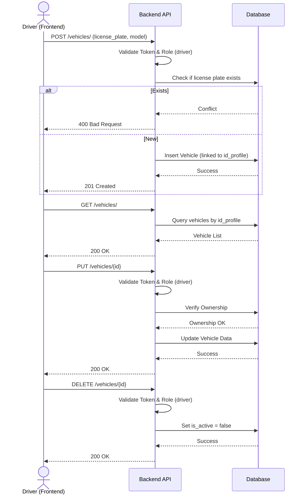

# Driver Vehicle Management Flow

```mermaid
sequenceDiagram
    actor Driver as Driver (Frontend)
    participant API as Backend API
    participant DB as Database

    %% Create Vehicle
    Driver->>API: POST /vehicles/ (license_plate, model)
    API->>API: Validate Token & Role (driver)
    API->>DB: Check if license plate exists
    alt Exists
        DB-->>API: Conflict
        API-->>Driver: 400 Bad Request
    else New
        API->>DB: Insert Vehicle (linked to id_profile)
        DB-->>API: Success
        API-->>Driver: 201 Created
    end

    %% Read Vehicles
    Driver->>API: GET /vehicles/
    API->>DB: Query vehicles by id_profile
    DB-->>API: Vehicle List
    API-->>Driver: 200 OK

    %% Update Vehicle
    Driver->>API: PUT /vehicles/{id}
    API->>API: Validate Token & Role (driver)
    API->>DB: Verify Ownership
    DB-->>API: Ownership OK
    API->>DB: Update Vehicle Data
    DB-->>API: Success
    API-->>Driver: 200 OK

    %% Delete Vehicle (Logical)
    Driver->>API: DELETE /vehicles/{id}
    API->>API: Validate Token & Role (driver)
    API->>DB: Set is_active = false
    DB-->>API: Success
    API-->>Driver: 200 OK
```
