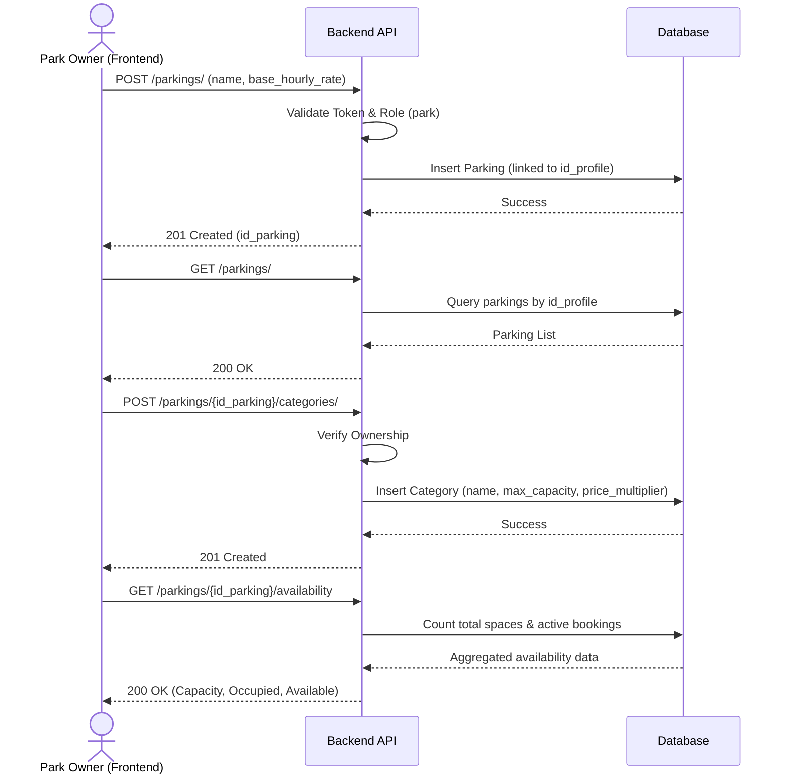

# Park Management Flow (Owner)

```mermaid
sequenceDiagram
    actor Owner as Park Owner (Frontend)
    participant API as Backend API
    participant DB as Database

    %% Create Parking
    Owner->>API: POST /parkings/ (name, base_hourly_rate)
    API->>API: Validate Token & Role (park)
    API->>DB: Insert Parking (linked to id_profile)
    DB-->>API: Success
    API-->>Owner: 201 Created (id_parking)

    %% Read Parkings
    Owner->>API: GET /parkings/
    API->>DB: Query parkings by id_profile
    DB-->>API: Parking List
    API-->>Owner: 200 OK

    %% Manage Categories
    Owner->>API: POST /parkings/{id_parking}/categories/
    API->>API: Verify Ownership
    API->>DB: Insert Category (name, max_capacity, price_multiplier)
    DB-->>API: Success
    API-->>Owner: 201 Created

    %% View Availability
    Owner->>API: GET /parkings/{id_parking}/availability
    API->>DB: Count total spaces & active bookings
    DB-->>API: Aggregated availability data
    API-->>Owner: 200 OK (Capacity, Occupied, Available)
```
