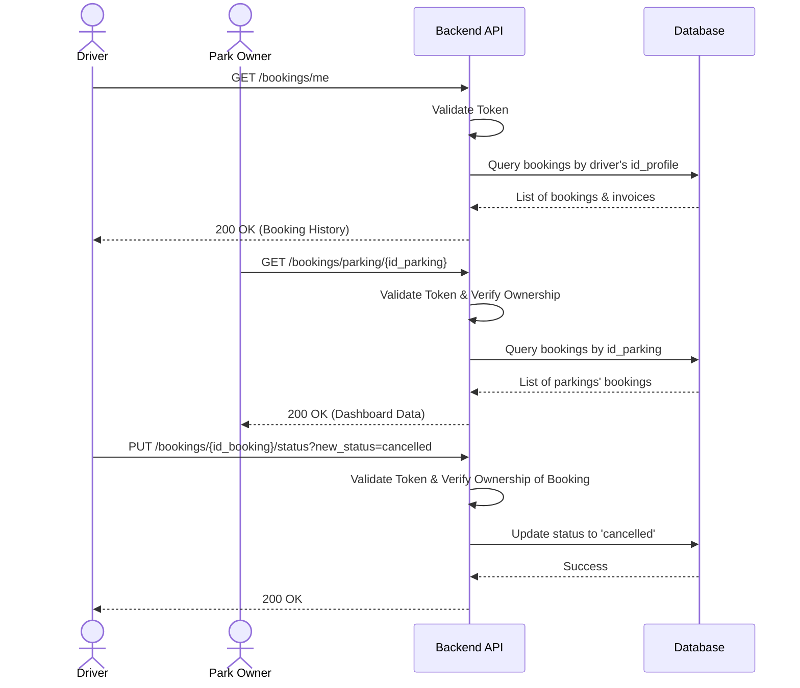

# Booking History & Management Flow

```mermaid
sequenceDiagram
    actor Driver as Driver
    actor Owner as Park Owner
    participant API as Backend API
    participant DB as Database

    %% Driver checking their history
    Driver->>API: GET /bookings/me
    API->>API: Validate Token
    API->>DB: Query bookings by driver's id_profile
    DB-->>API: List of bookings & invoices
    API-->>Driver: 200 OK (Booking History)

    %% Park Owner checking their parking's bookings
    Owner->>API: GET /bookings/parking/{id_parking}
    API->>API: Validate Token & Verify Ownership
    API->>DB: Query bookings by id_parking
    DB-->>API: List of parkings' bookings
    API-->>Owner: 200 OK (Dashboard Data)

    %% Change Booking Status (e.g. Cancel)
    Driver->>API: PUT /bookings/{id_booking}/status?new_status=cancelled
    API->>API: Validate Token & Verify Ownership of Booking
    API->>DB: Update status to 'cancelled'
    DB-->>API: Success
    API-->>Driver: 200 OK
```
